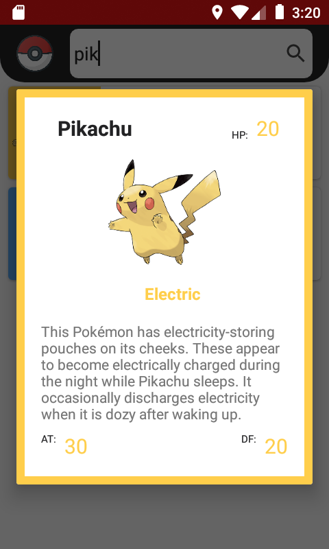

# Dojo Android: Aplicando padrões e bibliotecas

### Pokecards: Aplicativo de listagem de Pokemons

- master -> Projeto inicial do dojo.
- dojo_android -> Projeto com alterações.

## Screenshots

  
  

## O que vamos usar:

- MVVM
- Retrofit2
- Glide
- Lifecycle
- Coroutines
- Koin
- JUnit
- Mockito

[MIT](LICENSE) - Leon Manickchand - 2020
